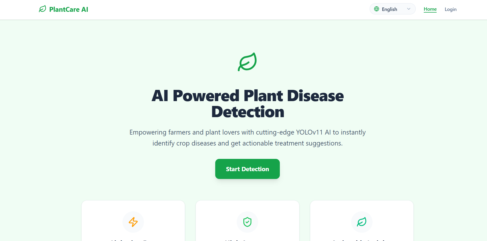

# AI-Based Plant Disease Detection System

<p align="center">
  
</p>

<p align="center">
YOLO • Flask • React • Grad-Cam
</p>

---

## Overview

This project is an AI-powered web application that detects plant diseases from leaf imagees. The system allows farmers and agricultural users to upload leaf images and receive disease predictions along with visual explanations using Grad-CAM heatmaps.

---

## Features

- Plant leaf disease detection using YOLO
- Support for multiple crop types
- Disease confidence score prediction
- Grad-CAM heatmap visualization
- Disease information and recommendations
- Flask backend API
- React frontend interface
- Image upload and analysis
- User-friendly web application

---

## Technology Stack

### Frontend
- React.js
- HTML
- CSS
- JavaScript

### Backend
- Flask
- Python

### AI/ML
- YOLO
- PyTorch
- OpenCV
- NumPy
- Grad-CAM

---

## Project Structure

```text
Plant-Disease-Detection/
│
├── backend/
├── frontend/
├── training/
├── screenshots/
│   ├── home-page.png
│   ├── upload-page.png
│   ├── result-page.png
│   └── heatmap-page.png
│
├── README.md
└── .gitignore
```

---

## Application Screenshots

### Home Page

<p align="center">
  
</p>

### Upload Page

<p align="center">
  
</p>

### Disease Prediction Result

<p align="center">
  
</p>

### Grad-CAM Heatmap Visualization

<p align="center">
  
</p>

---

## Installation

### Clone Repository

```bash
git clone https://github.com/ApoorvaR05/Plant-Disease-Detection.git
```

### Backend Setup

```bash
cd backend

python -m venv venv

venv\Scripts\activate

pip install -r requirements.txt

python app.py
```

### Frontend Setup

```bash
cd frontend

npm install

npm run dev
```

---

## Usage

1. Open the application in your browser.
2. Select the appropriate plant type.
3. Upload a clear leaf image.
4. View disease prediction results.
5. Analyze Grad-CAM heatmap visualization.
6. Read disease information and recommendations.

---

## Dataset

The model was trained using annotated plant leaf disease datasets containing multiple crop species and disease categories.

---

## Future Enhancements

- Mobile application support
- Real-time camera detection
- Multi-language support
- Cloud deployment
- Treatment recommendation system
- Disease severity estimation

---

## Team Members

- Apoorva R
- Team Member 2
- Team Member 3
- Team Member 4

---

## License

This project was developed for academic and educational purposes.
